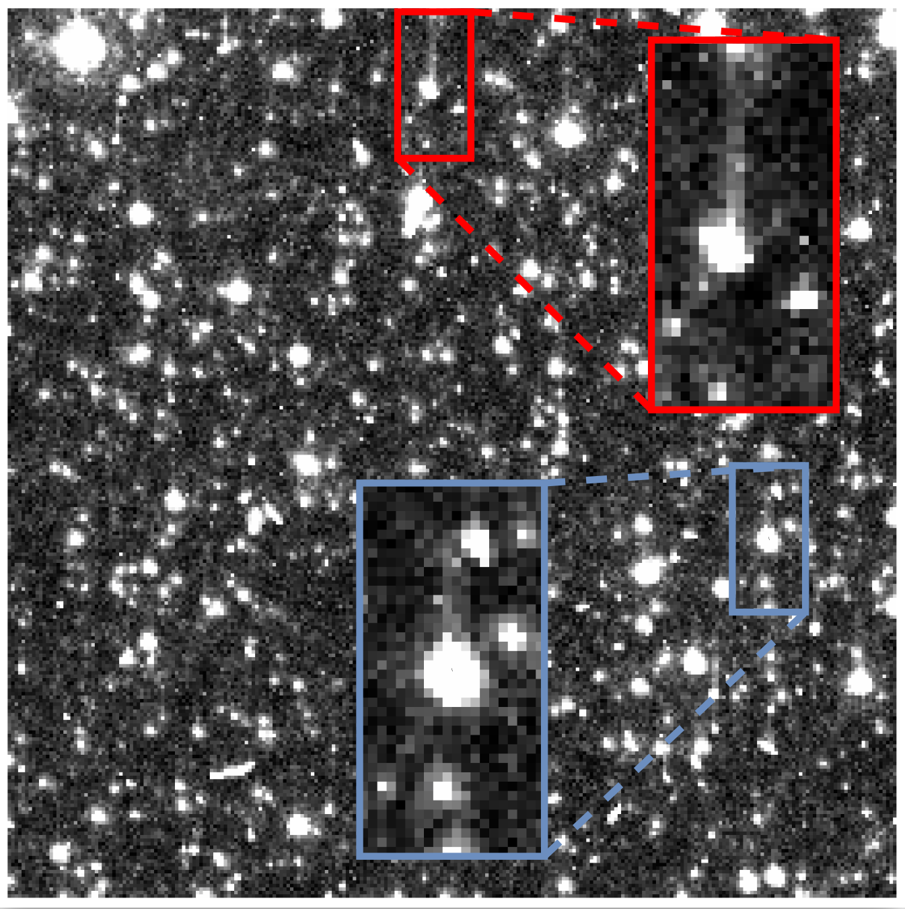

# CSST 去噪模型: DeCTI（Denoising Model for CSST: DeCTI）

## 1. Introduction
This is a supervised deep learning pipeline for correcting Charge Transfer Inefficiency (CTI) artifacts in astronomical images, which is caused by defects on CCD imaging sensor;
Each year, CSST acquires roughly two million images that require CTI correction, creating an urgent need for a method that is both highly accurate and exceptionally fast.

The results show that, compared to traditional SOTA, DeCTI achieves a roughly 2x improvement in accuracy while operating 100x faster. 
   
## 2. Architecture
The network architecture combines convolutional layers for local feature extraction with window-based transformer encoders for modeling long-range charge trailing.

1) Reformulating CTI correction as a 1-D sequence-tosequence task by treating each column vector as an
individual sample.

2) Designing a normalization method tailored to astronomical image distributions to stabilize and accelerate
training.

3) Introducing a hybrid main network that combines CNN layers and 1-D Transformer encoders within fixed windows.


## 3. Metrics:  
### Accuracy
Removal ratio:  
   
Relative Photometry Error:  
 
### Speed


## 4. Dataset:
One single Model is based on ACS camera and H814W optical filter in a single year, from Hubble Space Telescope (HST).
All HST filenames are listed in [train](config/remove_j92t/train.csv) [validation](config/remove_j92t/val.csv) [test](config/remove_j92t/test.csv) that can be downloaded with "observation_id" by [astroquery](https://astroquery.readthedocs.io/en/latest/esa/hubble/hubble.html);  
## 5. Dependency
All dependencies are listed in [environment.yaml](environment.yaml),  
```bash
conda env update -f environment.yaml
```  
## 6. Citation
```latex
@article{Men2025ChargeTransfer,
  author  = {Z. Men, L. Shao, P. Smirnov, M. Duan},
  title   = {DeCTI: Transformer-based Charge Transfer Inefficiency correction},
  journal = {IEEE Transactions on Image Processing},
  note    = {under review},
  year    = {2025}
}
```
## 7. Acknowledgements
This research is based on observations made with the NASA/ESA Hubble Space Telescope obtained from the Mikulski Archive for Space Telescopes (MAST). STScI is operated by the Association of Universities for Research in Astronomy, Inc., under NASA contract NAS5-26555.

This work is supported by the China Manned Space Program through its Space Application System.

DeCTI's release was made possible by the contributions of the following people:  
Zehua Men, Pavel Smirnov and Manni Duan are with Zhejiang Lab, Hangzhou, Zhejiang, China.  
Li Shao is with National Astronomical Observatories, Chinese Academy of Sciences, Beijing, China.

DeCTI uses the following separate libraries and packages:  
tensorboard  
pytorch  
gzip  
shutil  
numpy  
matplotlib  
pandas  
fitsio  
bisect  
gc  
sklearn  
seaborn  
astroquery
## 8. Third-party Software
Use of the third-party software, libraries or code referred to in the [Acknowledgements](#Acknowledgements) section above may be governed by separate terms and conditions or license provisions. Your use of the third-party software, libraries or code is subject to any such terms and you should check that you can comply with any applicable restrictions or terms and conditions before use
