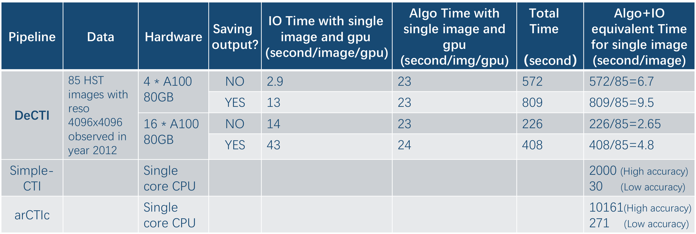

# DeCTI: Transformer-based Charge Transfer Inefficiency correction for CSST

## 1. Introduction
Charge Transfer Inefficiency (CTI) is a common defect in Charge-Coupled Device (CCD) imaging sensors, leading to charge trailing and signal distortion in astronomical images. The Chinese Space Station Telescope (CSST) acquires roughly two million images annually, all of which require CTI correction——posing an urgent demand for a solution that is both accurate and computationally efficient.

To address this challenge, we introduce **DeCTI**, a novel supervised deep learning pipeline designed to effectively mitigate CTI artifacts in astronomical images. As illustrated in the Figures below, DeCTI restores the degraded raw image (left) to a high-fidelity reconstruction (middle) that closely matches the “ground truth” image (right). Compared with traditional state-of-the-art approaches, DeCTI achieves approximately **2× higher correction accuracy** and is over **100× faster**, enabling large-scale, high-fidelity image restoration.

<div align="center">
   
</div>

## 2. Architecture
The DeCTI architecture integrates convolutional layers for local feature extraction with Transformer encoders to model long-range charge trailing patterns. Key design highlights:

- Reformulating CTI correction as a 1-D sequence-to-sequence task by treating each column vector as an independent sample.

- Introducing a custom normalization method tailored to astronomical image distributions to stabilize and accelerate training.

- Employing a hybrid architecture that combines CNN layers and 1-D Transformer encoders within fixed processing windows.

<div align="center">

</div>

## 3. Evaluation Metrics
### Removal Ratio
We define the **removal ratio**, a custom metric designed to quantify residual CTI artifacts on a column-wise basis. It measures the fraction of remaining error after correction——**lower values indicate better performance**. From the distribution of removal ratio across multiple samples, we derive **bias** and **dispersion** metrics, which respectively characterize the central tendency and spread of the removal ratio distribution, reflecting both the accuracy and stability of the correction.

<div align="center">
   
</div>

### Relative Photometry Error
**Relative photometry error** is a standard astronomical metric that quantifies the flux deviation relative to the ground-truth flux on cropped 2-D image stamps. Models are trained and inferred separately on Hubble Space Telescope (HST) images observed in 2005 and 2012. Two flux-measurement methods—**Aperture** and **Kron**—are adopted for comparison. 

The error distributions for multiple objects are shown below. The horizontal axis denotes the ground-truth flux, while the dots and lines on the vertical axis represent the bias and standard deviation of the relative photometry error, respectively. From left to right, the panels correspond to: (a) Aperture flux (2005 data), (b) Aperture flux (2012 data), (c) Kron flux (2005 data), and (d) Kron flux (2012 data).

<div align="center">
 
</div>

### Speed
Speed comparison between two existing SOTAs—"arCTIc" and "SimpleCTI" (both running on a single-core CPU)—and our DeCTI, evaluated on 4 GPUs and 16 GPUs, respectively. The rightmost column reports the consuming time for each image, including algorithm computation and I/O.


<div align="center">

</div>

## 4. Dataset
Each model is trained using data from a single year, obtained with the ACS camera and the F814W optical filter on the Hubble Space Telescope (HST).

All HST filenames for training, validation, and testing are listed in the corresponding files: [train](config/remove_j92t/train.csv)↗ [validation](config/remove_j92t/val.csv)↗ [test](config/remove_j92t/test.csv)↗.
The images can be downloaded using their ```observation_id``` by [astroquery](https://astroquery.readthedocs.io/en/latest/esa/hubble/hubble.html)↗.

## 5. Dependency
All software dependencies required to run the project are listed in [environment.yaml](environment.yaml)↗. 

To create or update the Conda environment, run the following command:

```bash
conda env update -f environment.yaml
```  

Please note that the environment includes all third-party libraries used in this work, including ```tensorboard```, ```pytorch```, ```numpy```, ```matplotlib```, ```pandas```, ```fitsio```, ```scikit-learn```, ```seaborn```, ```astroquery```, etc, all of which are essential for model development and evaluation. Users are encouraged to respect the respective licenses when using these tools.

## 6. License
This code repository are licensed under the [Apache License 2.0]().


## 7. Citation
If you use this work or the DeCTI code in your research, please cite the following paper:
```latex
@article{Men2025ChargeTransfer,
  author  = {Z. Men, L. Shao, P. Smirnov, M. Duan},
  title   = {DeCTI: Transformer-based Charge Transfer Inefficiency correction},
  journal = {IEEE Transactions on Image Processing},
  note    = {under review},
  year    = {2025}
}
```

## 8.code structers
csst-DeCTI/
|
├── baseline.sh            //script to train or inference
├── config                 //contain the list of filename
│   └── remove_j92t
│       ├── test.csv
│       ├── train.csv
│       └── val.csv
├── data_provider          //IO module for reorganizing datas
│   ├── data_factory.py
│   ├── data_loader.py
├── environment.yaml       //conda envs
├── LICENSE
├── main.py                //entry for project
├── models
│   ├── DeCTIAbla.py       //core model of DeCTI
│   ├── DnCNN.py           //other sota mehod
├── pipeline
│   ├── exp_basic.py       //initialization for the project
│   ├── exp_main.py        //pipeline for the project
├── README.md
└── utils
    └── tools.py

## 9. Acknowledgements
This research is based on observations made with the **NASA/ESA Hubble Space Telescope**, obtained from the **Mikulski Archive for Space Telescopes (MAST)**. STScI is operated by the Association of Universities for Research in Astronomy, Inc., under NASA contract NAS5-26555.

This work is supported by the **China Manned Space Program** through its Space Application System.
